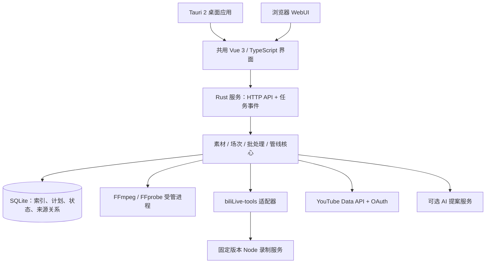

# U2BUP 统一录播与发布管理软件：设计草案

日期：2026-09-20。状态：架构目标与需求记录；v0.2 已加入自动切割、YouTube 上传与批量管理实现，YouTube 实号验收待用户配置 OAuth 后进行。实际验证范围见 [构建与验证记录](BUILD-STATUS.md)。本文中的完整规划不代表已全部实现。

## 1. 产品目标与明确需求

把直播间、历史录像、录制任务、后处理、YouTube 视频管理统一到一套可视化软件中。以批量操作为主要交互，逐渐加入 AI 辅助，不要求用户掌握正则、FFmpeg 命令或多个工具的配置。

用户明确要求：

1. Rust 底层，跨平台桌面 GUI 和 WebUI；开发测试可使用系统 FFmpeg，正式安装包内置必要处理组件。
2. 通过 YouTube Data API 实现上传和管理，重点是批量选择、分组、低学习成本的重命名和 AI 辅助。
3. 结合 biliLive-tools，保留 B 站等平台的直播录制、直播间管理、切片、合并等能力。
4. 吸收最新 PowerShell 脚本的实际需求，形成可自动运行的后处理管线，按日期、场次、画幅等规则合并，成品不得超过 YouTube 限制。
5. 第一批验收使用现有 LiveRec，优先直播间信息提取/抓取、录制文件管理和合并。

## 2. 建议架构

建议采用 Tauri 2 + Rust/Tokio + Axum + SQLite/SQLx + Vue 3/TypeScript/Vite。前端选 Vue 的原因是现有 biliLive-tools 也采用 Vue 3、Naive UI、Pinia，便于迁移可复用的组件与交互。具体依赖版本在实现时验证并锁定。

Tauri 使用系统 WebView 展示界面，业务与任务核心由 Rust 实现；这满足 Rust 底层与桌面/Web 共用 UI 的方向，但界面不是完全用 Rust 原生控件编写。如果用户所说的 Rust GUI 指纯 Rust 控件，这一决策需要调整。

### 服务与桌面生命周期

- 桌面壳启动/连接一个受管理的 Rust 服务，服务持有唯一任务队列和数据库写入权；不会由每个窗口启动第二套队列。
- 无界面模式运行同一 Rust 服务并托管 WebUI 静态资源。任务执行、凭据和媒体都在服务所在机器上。
- 默认单用户、本机回环监听。桌面访问使用启动时建立的认证会话；本地端口也校验身份、Origin/Host，避免任意网页调用文件操作。
- 如开启远程 WebUI：独立登录、TLS 部署、CSRF 防护、服务端媒体根目录授权；浏览器选择的本地路径不自动等于服务器路径。
- UI 关闭不等于任务完成。关闭桌面时提供继续后台运行或停止任务的行为；后端重启将遗留 running 任务标记为 interrupted 后按任务类型恢复。
- SSE 可传输任务进度，命令走 REST；事件包含序号和任务版本，重连后先拉取状态快照，不能只依赖瞬时事件。

### FFmpeg 与分发

- Rust 通过参数数组启动 FFmpeg/FFprobe，不拼接 shell 命令；并发、超时、取消和子进程回收由任务系统统一管理。
- 开发模式允许显式指定路径或使用 PATH；发行版优先且默认要求使用随包二进制，不能悄悄依赖用户安装的软件。
- 每个 OS/CPU 架构有独立组件清单，记录版本、哈希、编解码能力和许可证材料。通过 Tauri externalBin/资源目录打包。
- FFmpeg、FFprobe 为媒体基础必需项；弹幕处理、波形、其他录制器按功能矩阵随包提供或作为可选组件。复用录制服务时也要内置兼容的 Node 运行时及原生模块。
- 上游项目声明 GPL-3.0；记录复用文件、版本及第三方许可证，发行前完成相应分发材料。子进程隔离不是自动解决许可证问题的结论。
- Windows、macOS、Linux 分别构建和验收；首轮在本机 Windows 完成，其他平台未通过测试前不得标记已支持。移动端不在当前桌面范围内。

参考：[Tauri 架构](https://v2.tauri.app/concept/architecture/)、[外部二进制打包](https://v2.tauri.app/develop/sidecar/)。

## 3. biliLive-tools 复用策略

保留现有源码目录作为上游参考，新增软件放入独立目录。不要在第一阶段把所有平台录制代码翻译为 Rust。

第一步通过适配器连接其固定版本的 HTTP/CLI 服务；后续在安装包内受管运行。Rust 负责统一管理，录制服务负责既有平台协议与录制实现。

已核对的本地接口：

| 功能 | 接入依据 | 迁移要求 |
| --- | --- | --- |
| 直播间和录制任务 | docs/api/recorder.md、packages/http | 上游内部 recorder ID 与真实 room ID 分开保存 |
| 鉴权 | docs/api/base.md | 服务端保存 PassKey，不返回前端，不使用默认公共口令 |
| 元数据、合并、转码 | docs/api/video.md | 新软件的主合并队列统一由 Rust 管理，避免两套自动流程同时处理同一素材 |
| 切片与弹幕 | 现有 shared 和 Vue 功能 | 分阶段适配，逐项做能力回归 |
| 外部事件 | docs/features/external-event.md | 按事件 ID 去重，定期查询状态补偿丢失事件 |
| 平台支持 | Bilibili / DouYu / HuYa / DouYin / XHS / TikTok packages | 每个平台有独立能力和测试状态，不能以一个接口连通声称全部完成 |

现有文档明确提示 recorder/add 参数可能滞后，实现时以固定提交的路由、类型和实际请求为准，并建立契约测试。即使使用进程适配，仍需审查上游对 Electron、原生 Node 模块与平台二进制的依赖。

## 4. 统一数据模型

| 实体 | 责任与关键字段 |
| --- | --- |
| LibraryRoot | 授权素材根目录、默认时间解释、只读/可写能力 |
| Room | 平台 + 真实房间 ID 为稳定身份；当前主播名、UID、别名、资料抓取时间 |
| RoomAlias / SourceDirectory | 多个历史目录关联同一房间，保留原路径与历史名称 |
| RecordingAsset | 原文件路径、文件身份/大小/mtime、探测版本、时长、流参数、稳定性状态 |
| Sidecar | XML 弹幕、TXT 问题记录、封面等关联文件；没有视频也可以入库 |
| BroadcastSession | 场次、起止、标题历史、时间依据、自动分组置信度、人工修订 |
| ProcessingPlan | 不可变输入快照、规则版本、输出清单、拆分原因、空间预算 |
| Artifact | 合并/切片/转码成品、验证等级、完整来源及时间区间映射 |
| Job / JobAttempt | 队列、进度、重试、错误、执行日志、工作目录、恢复点 |
| ChannelConnection | YouTube channel ID、OAuth 授权引用、可用能力，不在普通数据库存明文令牌 |
| RemoteVideo / Upload | 云端 video ID、元数据快照、上传会话、确认偏移、处理结果、发布状态 |
| Collection / NamingRule | 本地分组、筛选条件、命名模板、正则高级规则 |
| ChangeSet | 批量修改前后差异、目标版本、执行结果、可补偿操作 |

显示名、本地文件名、YouTube 标题是三个不同字段。修改其中一个不能无提示地联动另两个。

文件大小和 mtime 仅用于快速变更检测，不能作为内容完全相同的证明；确认去重按需计算内容哈希。现有 MP4 在没有来源记录时标为“历史成品/来源待确认”，不能直接与原 FLV 混入同一合并任务。

### 时间与历史信息

优先使用 XML 中带偏移的 start_time，并与文件名和 roomid 交叉核对。文件名时间没有时区时按素材根目录规则解释，旧 Bilive 文件候选规则为 Asia/Shanghai；冲突应显示证据供修订。统一存 UTC 时间、原始值与来源，界面可按直播源时区显示。

不要按本机 America/New_York 的文件修改日期划分中国直播场次，也不要用当前网络资料覆盖历史标题。

## 5. 界面与批量管理

建议一级入口：素材库、直播间、处理管线、YouTube、任务中心、设置。

- 素材库：左侧房间/分组，中间可排序与虚拟滚动的文件/场次表格，右侧详情和预览；一键切换“按文件”和“按场次”。
- 列表支持搜索、状态/日期/画幅筛选、范围选择、全选筛选结果、保存视图。清楚区分选中当前页和选中全部匹配项目。
- 场次详情显示时间轴、原片段、断档、重叠、画幅切换、历史日志、输出成品与上传关联。
- 任务中心统一呈现扫描、探测、合并、转码、录制、上传及重试；实际不支持暂停的任务不显示假暂停按钮。

### 低学习成本的命名工作台

普通模式提供“添加主播名、选择日期格式、删除录制前缀、查找替换、添加序号”等规则块。模板可插入 {主播}、{日期}、{标题}、{画幅}、{序号}。

高级模式支持正则与捕获组；AI 可将自然语言转换为同一种受约束规则。所有模式共用变更预览：旧值、新值、匹配/未匹配、重名、非法字符、超限、会影响的项目数量。

本地重命名需要两阶段临时名以支持 A/B 互换、大小写变化，并更新 XML/TXT 关联及数据库路径；失败时提供恢复记录。YouTube 标题修改只修改远端元数据，本地分组只存数据库；只有用户明确选择同步时才映射为远端播放列表。

远端批处理不是一个跨所有视频的事务：逐项保存成功/失败/冲突，允许只重试失败项。恢复旧值是新的 API 写入，不能承诺任何远端变更都能无条件撤销。

### AI 的位置

用于标题清洗、描述/标签建议、命名规则生成、字幕与弹幕辅助切片、异常说明。AI 输出进入草稿或处理计划，使用与手动操作相同的验证器和差异预览。允许后续配置自动应用规则，但不能让模型直接产生任意 shell 命令或持有平台令牌。

首版无须 AI 凭据即可完成历史素材管理和合并；外部 AI 服务需要传输哪些标题、弹幕或字幕应在功能内明确显示。

## 6. 后处理管线：从脚本提炼成规则

流程：发现文件 → 判断录制结束/文件稳定 → 探测 → 提取历史资料 → 场次识别 → 生成计划 → 执行 → 验证 → 登记成品 → 可选上传 → 云端处理核验 → 可选归档。

### 场次与画幅

1. 按平台和真实房间 ID 分区，再按录制时间排序，合并同房间别名目录的逻辑视图。
2. 日期是筛选/命名维度，场次是处理实体。跨午夜可属于同一场；自然日切分为可选策略。
3. 标题尾部 _PART000 等重连标记规范化；保留原值。默认沿用同标题 + 结束到下一开始间隔不超过 30 分钟的保守规则，但阈值可配置，人工拆分/合并可覆盖。
4. 标题变化未必下播；记录分组原因和不确定性。显著负间隔、来源重叠或疑似重复进入待检查，不把旧脚本允许的 -300 秒重叠直接视为可无损拼接。
5. 默认沿时间线切成连续兼容段：横→竖→横得到三个连续输出。按画幅收集成两个合集为显式选项，并展示时间空洞。
6. 兼容性不只看宽高比，还看流数、编码、分辨率、SAR/DAR、旋转、像素格式、profile、timebase、帧率与音轨配置等。必要时比较 codec 参数/探测更深层结构；参数相同也不是全片恒定的证明。
7. 不兼容时分开输出，或由用户选择统一规格转码，禁止静默拉伸。

### YouTube 输出约束

上限同时检查 12 小时和 256 GB；未启用长视频资格的账号另有 15 分钟限制。建议默认目标时长 11 小时 55 分钟、体积留出封装余量，这些是软件保守策略而不是平台规定的新上限。[官方限制](https://support.google.com/youtube/answer/71673)

- 优先在源片段边界拆分。单个输入超限时必须安排实际切割，不能只对输入列表分组。
- 流复制切割受关键帧影响。计划给出余量，输出后检查实际时长/大小；仍超限则继续拆分。精确到非关键帧的剪辑作为需转码策略。
- _partN 再合并必须复用同一限制检查，不能作为绕过限制的后门。
- 输出名可读且带稳定产物 ID，避免同日同标题、不同音轨/编码规格产生碰撞。
- 以临时文件写入；进程退出成功后检查流、时长、大小、时间戳及抽样解码，才正式登记并发布成品路径。完整解码作为可选更高验证等级。
- 不能只以“存在同名文件”判断完成：核对计划指纹、产物记录、文件状态及验证结果。
- 记录片段到成品的时间映射，用于弹幕平移、字幕、章节和切片追溯。

### 持久任务与资源

处理计划保存源文件身份、大小、mtime、探测版本、规则版本；执行前重新检查，源变化则计划失效。任务具有 pending/running/interrupted/failed/completed/cancelled 等可持久状态。

探测缓存避免重复扫描；按 CPU、GPU、磁盘、网络分类限制并发。空间预算计入临时文件、最终文件和其他任务预留，而不只查看启动瞬间剩余空间。合并中断可重新生成该产物，不伪称 FFmpeg 任意位置可断点续算；上传使用协议支持的续传。

原始素材保留作为默认策略，归档/删除另设规则并依赖合并验证与明确的云端状态条件。

## 7. YouTube 上传与管理

| 需求 | 实现方向 |
| --- | --- |
| 连接账号/频道 | OAuth 授权后明确显示 channel ID；不同频道分别记录实际授权关系 |
| 导入云端视频 | 读取频道 uploads 播放列表，分页读取并同步视频详情，支持刷新和冲突检测 |
| 上传 | videos.insert + resumable upload，持久化会话和已确认字节，重试前先查询服务端偏移 |
| 批量标题、描述、标签、隐私、定时发布 | 差异预览、字段校验、逐项 videos.update、失败重试、同步最新值 |
| 封面、字幕、播放列表 | 各资源接口独立任务，不与视频上传成功混为一个状态 |
| 处理状态 | 上传完成、YouTube 处理完成、发布完成三个独立状态 |
| 本地分组 | 自定义标签/智能分组；用户选定后才同步为播放列表 |

上传恢复采用服务器返回的确认范围，不能相信只存在客户端的进度；会话过期重新建任务前核对已有远端视频与历史响应。请求成功但响应丢失时标记结果待核实，不直接重复上传。参考：[断点续传协议](https://developers.google.com/youtube/v3/guides/using_resumable_upload_protocol)。

### 必须进入产品设计的 API 边界

- 桌面 OAuth 用系统浏览器、PKCE/state 和本机回调；远程 Web 部署单独采用 Web 服务端 OAuth 回调。刷新令牌存于系统凭据存储或服务端机密存储，前端不持有长期令牌。[桌面 OAuth](https://developers.google.com/identity/protocols/oauth2/native-app)、[Web OAuth](https://developers.google.com/identity/protocols/oauth2/web-server)
- 仅有 API key 不能管理用户频道；上传权限和元数据管理权限分开考虑。
- 未经审计的适用 API 项目上传视频会被限制为私有；这是 API 项目状态问题，和频道长视频验证是两件事。[videos.insert](https://developers.google.com/youtube/v3/docs/videos/insert)
- videos.update 可能覆盖所选 part 中未保留的可写字段。更新前读取最新资源并保留不修改的字段；发现与预览快照不符时提示冲突，不能只发送 title 丢掉其他元数据。[videos.update](https://developers.google.com/youtube/v3/docs/videos/update)
- 标题限制 100 字符，描述限制 5000 字节；长度计数、UTF-8 和非法字符分别验证。[Video 资源](https://developers.google.com/youtube/v3/docs/videos)
- 本次查到的配额正文为 search.list 与 videos.insert 各独立默认每日 100 次，其余端点共用默认每日 10,000 units；videos.update 每次 50 units。官方配额页顶部自动摘要仍出现旧的 1600 数字，与正文/当前方法页不一致。不要把旧数值写死；显示规则来源、核对日期、保守估算和实际 quota 错误，以项目控制台为最终依据。[配额正文](https://developers.google.com/youtube/v3/determine_quota_cost)
- Data API 的可写字段不能代表完整 Studio 功能。收益/详细分析、版权申诉和所有 Studio 编辑功能不能在没有专用接口验证时承诺支持；界面按能力表显示。

## 8. 第一阶段真实素材基线

详见 research/liverec-baseline.json；2026-09-20 使用系统 FFprobe 8.0 只读探测。

- 88 个目录，对应 83 个按目录提取的不同房间号；此数目未通过在线接口统一短号/真实号验证。
- 122 FLV + 41 MP4，共 163 视频，286,525,572,849 字节，约 266.85 GiB。
- 163 个文件均可读取流元数据，162 个时长已知，已知时长合计约 171.30 小时；该值不去重，不包含未知时长文件，也不代表唯一直播时长。
- 已知时长的文件均未超过 12 小时，最长约 6 小时 11 分 30 秒。21263282-Yommyko/Yommyko_摸一摸.flv 约 929 MiB，容器时长未知且名称不符合常规录制格式，必须进一步检测，不能当作 0 秒或已确认未超限。
- 探测到的视频流均为 H.264：1920×1080 136 个、1280×720 7 个、1080×1920 12 个、720×1280 8 个。
- 1,081 XML，877 TXT，55 个旧 concat.ps1。元数据可读不等于已完成全片损坏检测。
- room ID 23186926、24337682、27308354 存在多个历史目录名。
- XML 实例包含 BililiveRecorderRecordInfo：roomid、shortid、name、title、分区和带时区 start_time，可用于离线恢复历史资料。
- 当前 shell 能找到 Node 26.5.0、FFmpeg/FFprobe 8.0；未在 PATH 和默认 .cargo/bin 找到 Rust 工具链，需要在开始实现时检查/准备，不等同于证明全机完全没有安装。

## 9. 实施阶段与完成标准

| 阶段 | 可交付结果 | 完成标准 |
| --- | --- | --- |
| M0：架构与基线 | 本文、只读库存、验收清单 | 明确真实数据和 API 边界；本轮完成 |
| M1：历史素材闭环 | Rust 服务 + 共用 UI + Windows 桌面入口；索引、资料、计划、合并、验证 | LiveRec 全量导入，代表场次实际合并通过，恢复/幂等/超限测试通过 |
| M2：YouTube 闭环 | OAuth、频道视频同步、续传上传、批量编辑、播放列表与处理状态 | 测试频道真实操作验收；配额、授权过期、部分失败正确呈现 |
| M3：录制整合 | biliLive-tools 受管服务、平台房间、录制、切片与弹幕功能 | 各能力逐项验收，录制结束事件可驱动后处理 |
| M4：自动化与 AI | 管线模板、命名助手、元数据建议、字幕/弹幕辅助切片 | 产物可追溯，失败可恢复，自动应用范围可配置 |
| 发行验证 | Windows/macOS/Linux 安装包、内置组件、升级与迁移 | 干净环境无需全局 Node/FFmpeg/Python，平台实机/CI 验收通过 |

阶段顺序体现先完成现有 LiveRec 的要求，后续能力仍属于整体目标。M1 不以需要 Google 凭据或联网抓取成功作为导入本地录像的前置条件。

## 10. 建议默认值与待确认选择

建议默认：个人单用户；WebUI 先本机、后扩展远程；桌面目标 Windows/macOS/Linux；Vue 共用 UI；Rust 持有核心业务，biliLive-tools 以受管服务渐进复用；原片保留；输出目标 11h55m；直播源时间按证据与根目录配置解释。

后续需要决定：是否要求纯 Rust 控件、是否需要首发远程访问/多用户、是否要求第一版所有录制依赖也全部 Rust 化、频道数量、成品/原片保留策略，以及 AI 服务偏好。这些选择不阻碍先把 LiveRec 导入、计划与验证做好。

本文没有证明 M1–M4 已完成，没有执行录制、上传、重命名或合并原始素材。
